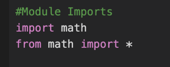
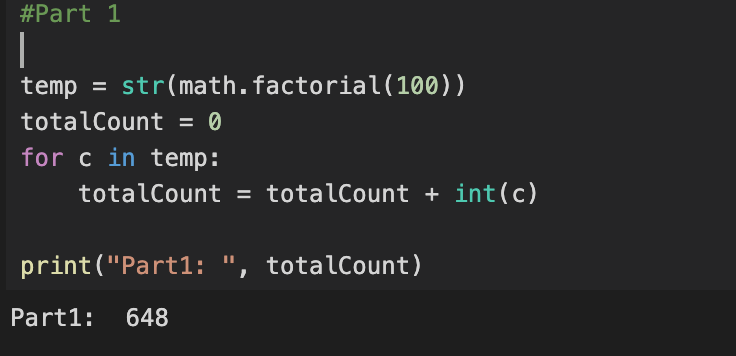
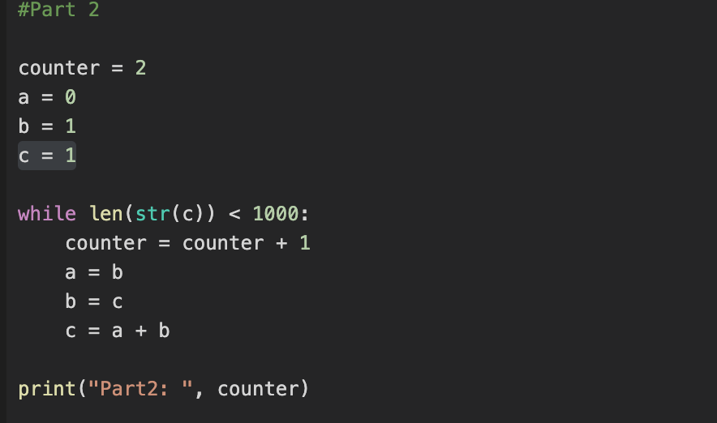
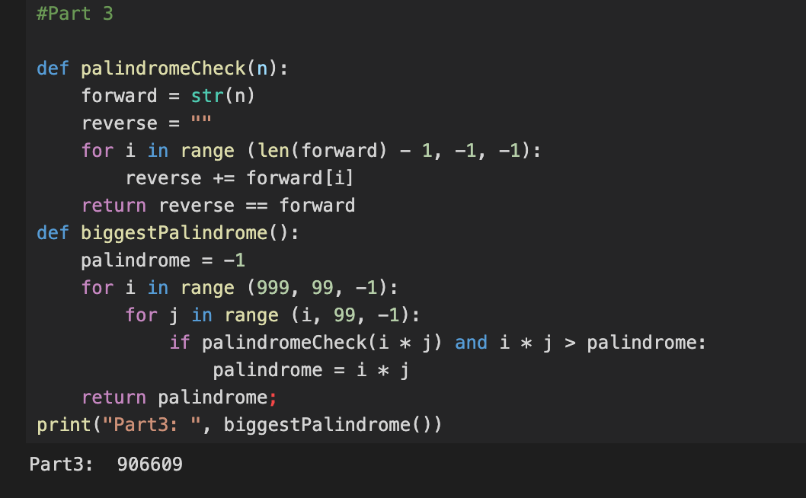

# Our Version of “Hello World”

This is an introduction and refresher on Python, different version on "Hello World" to get started with before we get serious into Data Science portion of assignments. We will have three main parts in this beginning project. We will be implementing n! means, the Fibonacci sequence, and finding the largest palindrome. The code can be used in normal python or Jupyter Notebook.

### Implementation

We will start by importing the module(s) we will need for this assignment.

Implementing part 1 of the assignment is to implement n! means to find the sum of the digits in the number 100.

Implementing part 2 of the assignment is “The Fibonacci sequence”. We will find the first term in the Fibonacci sequence to contain 1000 digits. 

Implementing part 3 of the assignment is a “Palindromic number”. The largest palindrome made from the product of two 3-digit numbers.

We can see that the code in all three sets produced the correct answers to fulfill this assignment.
